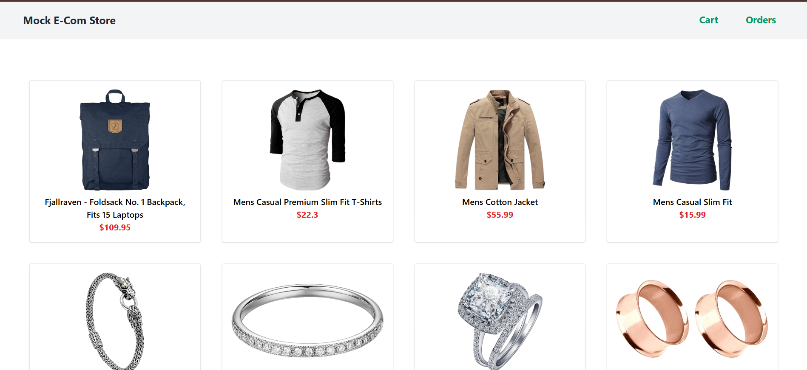
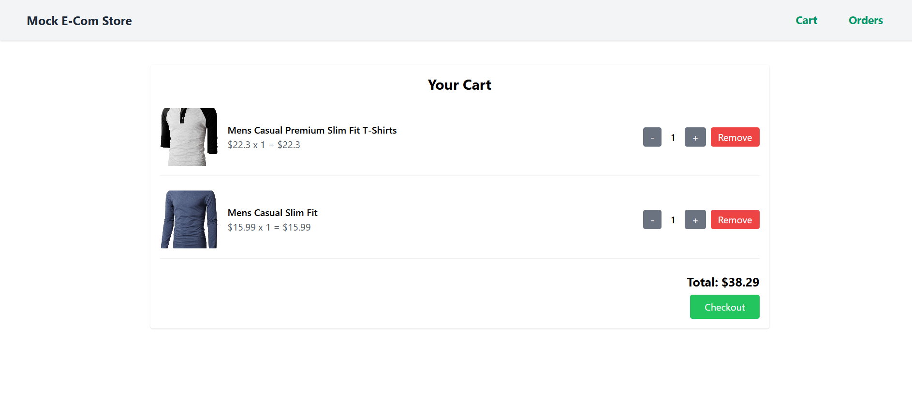
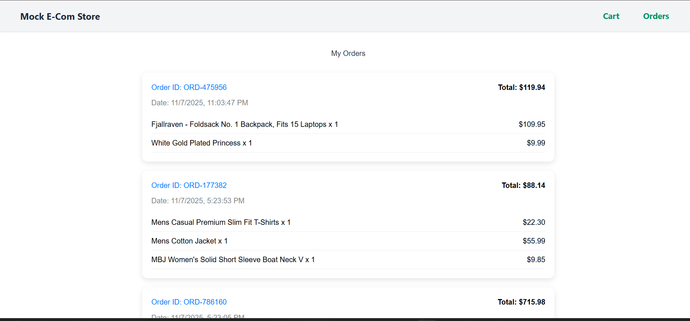

# 🛒 Mock E-Commerce Cart

<div align="center">


A full-stack shopping cart application built for **Vibe Commerce** internship screening. This project demonstrates a complete e-commerce flow including product listing, cart management, and checkout with persistent order storage.

[Features](#-features) • [Tech Stack](#-tech-stack) • [Installation](#-installation--setup) • [Usage](#-how-to-use) • [API Documentation](#-api-endpoints)

</div>

---

## 📂 Project Structure

```
mock-ecom-cart/
├── backend/
│   ├── config/
│   │   └── db.js                 # MongoDB configuration
│   ├── controllers/
│   │   ├── productController.js  # Product business logic
│   │   ├── cartController.js     # Cart operations
│   │   └── orderController.js    # Order management
│   ├── models/
│   │   ├── productModel.js       # Product schema
│   │   ├── cartModel.js          # Cart schema
│   │   └── orderModel.js         # Order schema
│   ├── routes/
│   │   ├── productRoutes.js      # Product endpoints
│   │   ├── cartRoutes.js         # Cart endpoints
│   │   └── orderRoutes.js        # Order endpoints
│   ├── .env                      # Environment variables
│   ├── server.js                 # Express server setup
│   └── package.json
│
├── frontend/
│   ├── src/
│   │   ├── components/
│   │   │   ├── ProductList.jsx   # Products grid
│   │   │   ├── Cart.jsx          # Shopping cart
│   │   │   └── Orders.jsx        # Order history
│   │   ├── App.jsx               # Main app component
│   │   └── main.jsx              # Entry point
│   └── package.json
│
└── README.md
```

---

## 🛠️ Tech Stack

### Frontend
- **React** - UI library
- **Vite** - Build tool
- **CSS3** - Styling

### Backend
- **Node.js** - Runtime environment
- **Express.js** - Web framework
- **MongoDB** - Database
- **Mongoose** - ODM

### APIs
- RESTful architecture
- Fake Store API integration (optional)

---

## ⚡ Features

### Backend Features
| Endpoint | Method | Description |
|----------|--------|-------------|
| `/api/products` | GET | Fetch 5-10 mock products with ID, name, price |
| `/api/cart` | GET | Retrieve current cart with calculated total |
| `/api/cart` | POST | Add product to cart with quantity |
| `/api/cart/:id` | DELETE | Remove item from cart (partial/full) |
| `/api/cart/checkout` | POST | Process checkout and create order |
| `/api/orders` | GET | Retrieve all orders for mock user |

### Frontend Features
✅ **Products Page** - Grid layout with "Add to Cart" functionality  
✅ **Cart Management** - Update quantities, remove items, view totals  
✅ **Checkout System** - Submit orders with receipt modal  
✅ **Order History** - View past orders with details and timestamps  
✅ **Responsive Design** - Mobile-friendly interface  
✅ **Error Handling** - User-friendly error messages  

---

## 🚀 Installation & Setup

### Prerequisites
- Node.js (v14 or higher)
- MongoDB (local or Atlas)
- npm or yarn

### Backend Setup

1. **Navigate to backend directory**
   ```bash
   cd backend
   ```

2. **Install dependencies**
   ```bash
   npm install
   ```

3. **Create environment file**
   
   Create a `.env` file in the backend directory:
   ```env
   MONGO_URI=mongodb://localhost:27017/ecommerce
   # Or use MongoDB Atlas connection string
   # MONGO_URI=mongodb+srv://<username>:<password>@cluster.mongodb.net/ecommerce
   
   PORT=5000
   NODE_ENV=development
   ```

4. **Start the server**
   ```bash
   npm run dev
   ```
   
   Server will run on: **http://localhost:5000**

### Frontend Setup

1. **Navigate to frontend directory**
   ```bash
   cd frontend
   ```

2. **Install dependencies**
   ```bash
   npm install
   ```

3. **Start the development server**
   ```bash
   npm run dev
   ```
   
   App will run on: **http://localhost:5173**

---

## 📸 Screenshots

<div align="center">

### Products Page

*Display products in a grid layout with "Add to Cart" buttons*

### Cart Page

*Manage cart items, update quantities, and proceed to checkout*

### Orders Page

*View complete order history with details and timestamps*

</div>

---

## 🎯 How to Use

1. **Browse Products**
   - Open the Products page
   - Click "Add to Cart" on any product

2. **Manage Cart**
   - Navigate to Cart page
   - Update quantities using +/- buttons
   - Remove items if needed
   - View real-time total calculation

3. **Checkout**
   - Click "Checkout" button
   - Order is saved to database
   - View order confirmation

4. **View Orders**
   - Go to Orders page
   - See all previous orders with:
     - Unique Order ID
     - Order date and time
     - Total amount
     - List of purchased items

---

## 📡 API Endpoints

### Products

```http
GET /api/products
```
**Response:**
```json
[
  {
    "_id": "1",
    "name": "Product Name",
    "price": 29.99,
    "description": "Product description",
    "image": "image_url"
  }
]
```

### Cart

```http
POST /api/cart
Content-Type: application/json

{
  "productId": "1",
  "quantity": 2
}
```

```http
GET /api/cart
```

```http
DELETE /api/cart/:productId
```

### Orders

```http
POST /api/cart/checkout
```

```http
GET /api/orders
```

---

## 💡 Bonus Features

- ✅ Database persistence for mock user
- ✅ Comprehensive error handling
- ✅ Optional Fake Store API integration
- ✅ Responsive design
- ✅ Loading states and user feedback
- ✅ Order history with detailed information

---

## 🔮 Future Improvements

- [ ] User authentication and authorization
- [ ] Multiple user support
- [ ] Order filters and search functionality
- [ ] Product categories and filtering
- [ ] Payment gateway integration
- [ ] Email notifications
- [ ] Advanced analytics dashboard
- [ ] Product reviews and ratings
- [ ] Wishlist feature
- [ ] Dark mode support

---

## 📜 Demo Video

> 🎥 [Watch Demo Video](#) - Complete walkthrough of products → cart → checkout → orders workflow

---

## 🤝 Contributing

Contributions are welcome! Please feel free to submit a Pull Request.

1. Fork the project
2. Create your feature branch (`git checkout -b feature/AmazingFeature`)
3. Commit your changes (`git commit -m 'Add some AmazingFeature'`)
4. Push to the branch (`git push origin feature/AmazingFeature`)
5. Open a Pull Request

---

## 📝 License

This project is licensed under the MIT License - see the [LICENSE](LICENSE) file for details.

---

## 👤 Author

**Your Name**

- GitHub: [@yourusername](https://github.com/yourusername)
- LinkedIn: [@yourprofile](https://linkedin.com/in/yourprofile)

---

## ⭐ Show your support

Give a ⭐️ if this project helped you!

---

<div align="center">

**Built with ❤️ for Vibe Commerce Internship Screening**

</div>